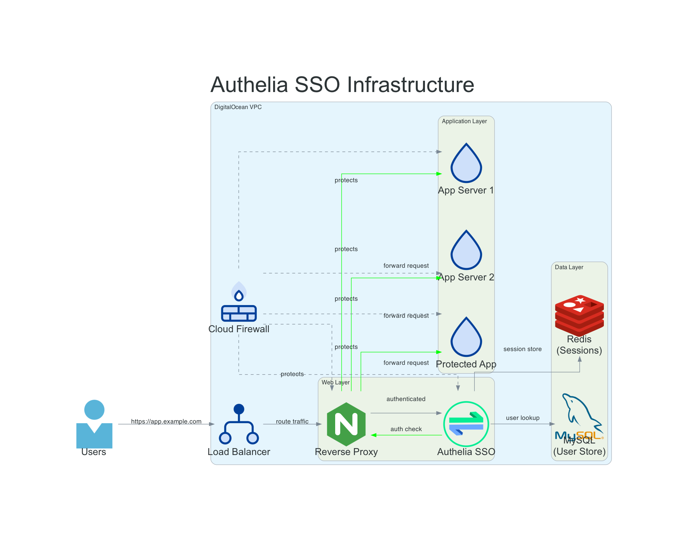

# FINI Infra Architecture Diagrams

## Requirements

To rebuild these architecture diagrams you will need:

- The [diagrams](https://diagrams.mingrammer.com/) library, which has
  [good documentation](https://diagrams.mingrammer.com/docs/guides/diagram).
- [uv](https://github.com/astral-sh/uv) package manager installed

`uv` is like magic - you don't have to care whether the virtualenv
exists or not - it will just create it for you on the fly.
Even more amazing is how it can do all of that in a fraction
of a second for the not tiny `diagrams` module AND all of its
dependancies.  Inconceivable!

## Static Web Serving

## Authelia SSO

